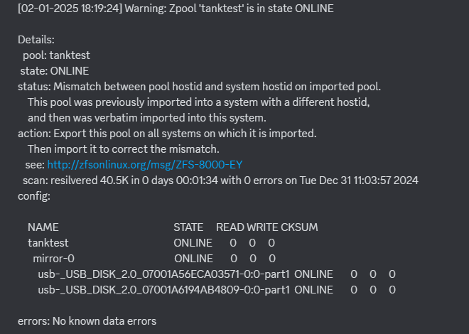
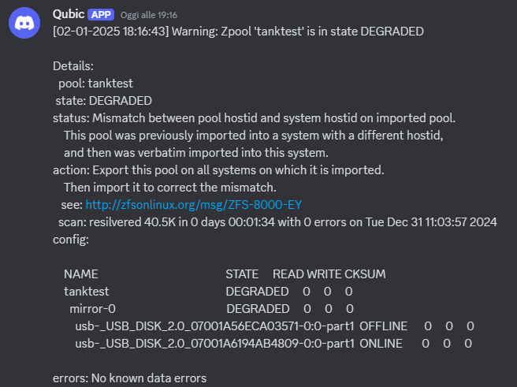

# zfsMiniMonitor
A Docker-based solution for monitor the status of your ZFS zpool and send notifications via Discord webhook.

## How it works?
The script continuously monitors the zpool (based on the `ZPOOL_NAME` variable) at regular intervals (defined by the `CHECK_INTERVAL` variable). \
If it detects a change between checks, it sends the full output via a Discord webhook (using the `WEBHOOK_URL` variable).

## Features
- Runs entirely within a Docker container for simplicity and portability.
- Periodically monitors the status of a specified zpool.
- Sends real-time notifications to Discord when the zpool status changes.
- Provides detailed information about the current zpool state.

## Requirements
- Docker and Docker Compose
- ZFS installed on the host system
- Discord Webhook url

## Install via Docker Compose

```
version: '3.8'
services:
  zfsminimonitor:
    container_name: zfsminimonitor
    image: ghcr.io/zewol95/zfsminimonitor:1.0
    privileged: true
    network_mode: bridge
    environment:
      - ZPOOL_NAME=<YOUR_TANK_NAME>                # Insert here your zpool name
      - WEBHOOK_URL=<YOUR_DISCORD_WEBHOOK_URL>     # Insert here your Discord Webhook url
      - CHECK_INTERVAL=10                          # Time in seconds between checks
    volumes:
      - /dev:/dev
      - /proc:/proc
    restart: unless-stopped

```

## Logs in Docker
Open the console log for see what the script is detecting: \
The zpool is ONLINE: 
```
[02-01-2025 18:14:28] Zpool 'tanktest' status: ONLINE
```
\
The zpool is DEGRADED: 
```
[02-01-2025 18:16:43] Zpool 'tanktest' status: DEGRADED
Message sent successfully: [02-01-2025 18:16:43] Warning: Zpool 'tanktest' is in state DEGRADED
Details:
  pool: tanktest
 state: DEGRADED
status: Mismatch between pool hostid and system hostid on imported pool.
	This pool was previously imported into a system with a different hostid,
	and then was verbatim imported into this system.
action: Export this pool on all systems on which it is imported.
	Then import it to correct the mismatch.
   see: http://zfsonlinux.org/msg/ZFS-8000-EY
  scan: resilvered 40.5K in 0 days 00:01:34 with 0 errors on Tue Dec 31 11:03:57 2024

config:

	NAME                                              STATE     READ WRITE CKSUM

	tanktest                                          DEGRADED     0     0     0

	  mirror-0                                        DEGRADED     0     0     0

	    usb-_USB_DISK_2.0_07001A56ECA03571-0:0-part1  OFFLINE      0     0     0

	    usb-_USB_DISK_2.0_07001A6194AB4809-0:0-part1  ONLINE       0     0     0

errors: No known data errors
```
## The Discord's messagge
The zpool is back ONLINE: \

\
The zpool is DEGRADED: \



